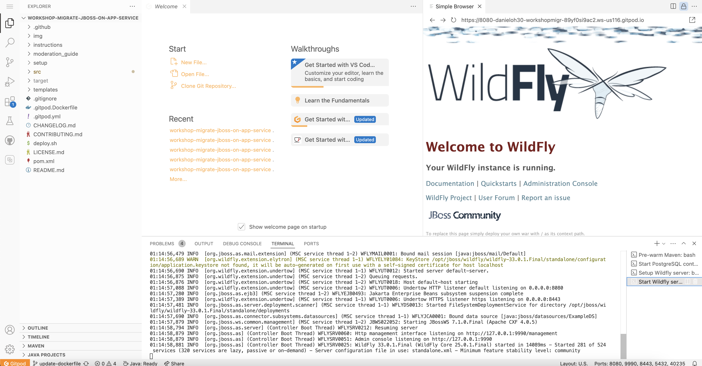
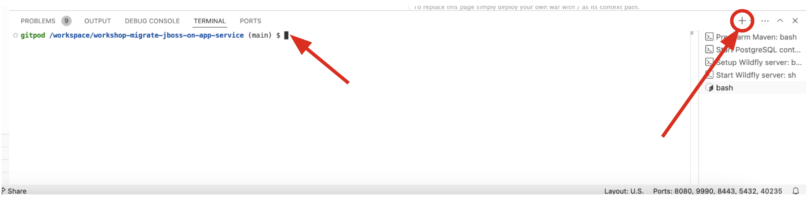

# 1 - Set up your environment

This workshop uses GitPod to provide a pre-configured development environment with Java, JBoss, and the Red Hat VS Code extensions ready-to-go! This section will guide you through the process of setting up a GitPod account and project.

## 1.1 - GitPod Setup

1. Fork [the workshop repository](https://github.com/Azure-Samples/workshop-migrate-jboss-on-app-service) into your personal **GitHub** account.
2. Go to [GitPod](https://gitpod.io/) and create an account. You can use the Single-Sign-On to create a GitPod account from your **GitHub** account.

    

3. On the next screen, select **Configure your own repository**.

    

4. Select a repository and key in your forked workshop repository.

    > Leave the other configurations (e.g., VS Code version, Standard) by default

    

4. Next, select **Contiute**.

    > It takes a few minutes to create a new workspace.

5. The next screen will show a new cloud IDE based on VS Code.

   

   > If you see the following warning popou on the bottom, select `Install and Reload` button.

    

## 1.2 - Sign into Azure

The exercises in this workshop will involve creating and configuring resources from the Azure CLI and Azure Portal. The GitPod workspace already has the Azure CLI installed, but you will have to sign in from the CLI.

1. Open the VS Code terminal in GitPod by going to the existing `bash` terminal:

    

2. Run the following command to get a device authorization code and open a browser tab to the device login page.

    ```bash
    az login --use-device-code & gp preview --external https://microsoft.com/devicelogin
    ```
    
    Copy the device login code from the terminal output and paste it into the device login page. Follow the instructions on the login page.

3. To confirm your CLI is authenticated, run the following command. This will output summary information about your Azure Subscription.

    ```bash
    az account show
    ```

> If you couldn't authenticate using the browser window, you can log in using your username and password directly in the command, `az login -u johndoe@contoso.com -p verySecretPassword`. This only works if your account does **not** have 2FA enabled.

## 1.3 - Configure the workspace

Let's set some environment variables for later use. Press `F1` to open the command search window, and type `settings` into the search box, then select **Preferences: Open Workspace Settings (JSON)**. This will open a mostly empty file:


Replace the entire file with the below content, and then replace the placeholder values in `[]` with your unique values. Note that some of these must be globally unique, so consider adding your name or initials to them. You can optionally use a different `LOCATION` (the Azure region in which your resources will be deployed later on) if you want it to be closer to your geographic location.

> **HINT**: Valid values for `LOCATION` can be discovered by running `az account list-locations|jq '.[].name'` in the terminal.

> **HINT**: You can discover your Subscription ID with `az account show | jq -r .id`

```jsonc
{
    "terminal.integrated.env.linux": {
        // Obtain your subscription ID with hint above
        "SUBSCRIPTION_ID": "[Your Azure Subscription ID]",

        // these must be unique to you, consider using initials of your name
        "DB_SERVER_NAME": "[Your initials]-postgres-database",
        "WEBAPP_NAME": "[Your initials]-webapp",

        // this must be the same name from the ARM template you deployed earlier, and different from WEBAPP_NAME
        "ASE_WEBAPP_NAME": "[Your initials]-ase-webapp",

        // these are OK to be hard-coded
        "RESOURCE_GROUP": "jboss-rg",
        "SERVICE_PRINCIPAL_NAME": "jboss-ase-sp",
        "DB_USERNAME": "cooladmin",
        "DB_PASSWORD": "EAPonAzure1",

        // use this default, or use a location closer to you
        "LOCATION": "eastus"
    }
}
```

Close your existing bash Terminal since it will not have these new settings (careful not to close the others!).

> **Note**
> 
> All changes will be automatically saved.


Next, open a new Terminal using the `＋` button and confirm the values are correct by running this command in the new Terminal:

```sh
for var in $(cat $GITPOD_REPO_ROOT/.vscode/settings.json \
    | grep -v '//' \
    | jq -r '."terminal.integrated.env.linux"
    | keys | join(" ")') ; do 
        val=$(eval echo \$$var); echo $var = $val
done
```


You should see the same values you entered. Now each new Terminal you open will have these settings. Some of the commands you run later in the workshop will reference these variables.

> **Warning**
> 
> If you still see placeholder values instead of the values you entered into the JSON file, ensure that
> the file is saved by clicking into the file, and using `CTRL-S` (or `CMD-S` on a Mac), then close the
> newly-opened Terminal and open a new one and try the above command again until it shows correct values.

## 1.4 - Deploy the App Service Environment

> **Warning:**
>
> If you already executed this the day before the workshop, you can safely skip this section,
> as there is no need to execute it again (it will produce a deployment error that is harmless).

Later sections of this workshop will introduce and explain the App Service Environment, a single-tenant version of App Service. This service is quite large, so we will initiate the deployment for it now so that it is ready for us in the later sections of the workshop

1. First, create a resource group:

    ```bash
    az group create --name $RESOURCE_GROUP --location $LOCATION
    ```

2. Next, deploy the ARM Template to that resource group (this will take 2-3 hours to complete!). The `ASE_WEBAPP_NAME` must be globally unique, so consider using part of your name or including numbers.

    ```bash
    az deployment group create \
        --name ase_deployment \
        --resource-group $RESOURCE_GROUP \
        --template-uri https://raw.githubusercontent.com/Azure-Samples/workshop-migrate-jboss-on-app-service/main/templates/ase-template.json \
        --no-wait \
        --parameters webAppName=${ASE_WEBAPP_NAME}
    ```

> **Tip**: You will see what resources (e.g., template, vnet, public IP address) are being created on the _Overview_ page in your resource group.

*Congratulations!* Your GitPod workspace is now ready to go. Click the link below to go to the next section

---

➡️ Next section: [2 - Learn about Azure App Service](2-learn-about-app-service.md)
