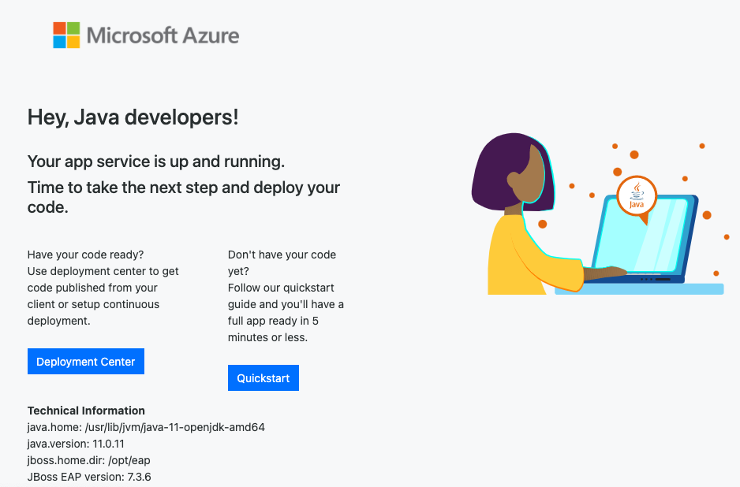
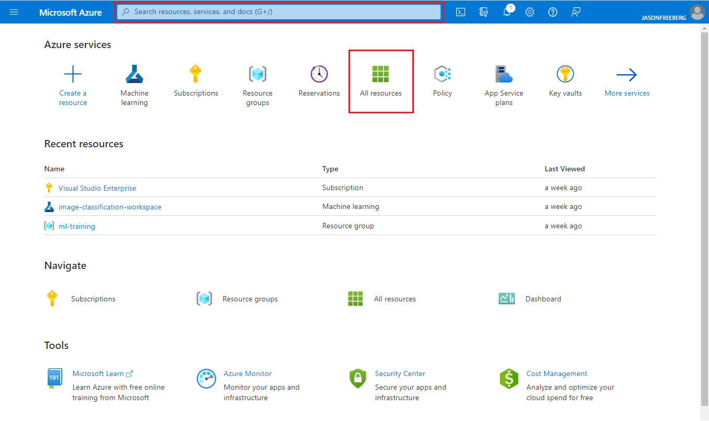
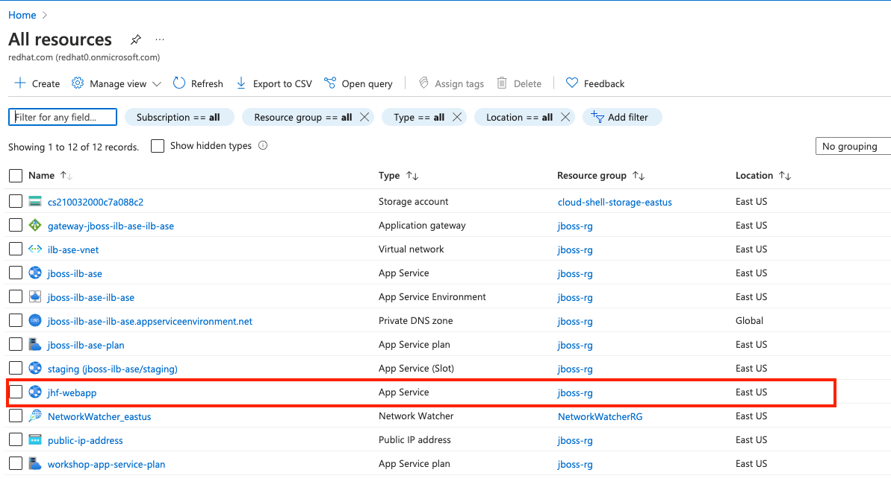
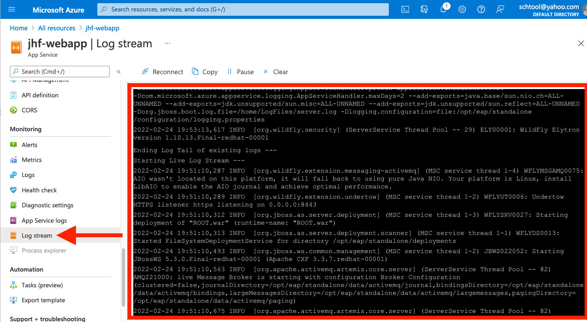
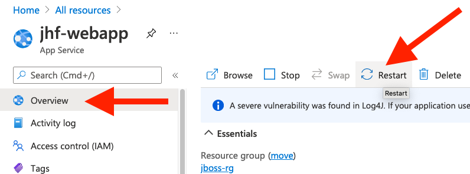

# 2 - Learn About Azure App Service

## 2.1 - Introduction

Azure App Service is a proven managed platform for hosting web and API applications for businesses large and small. App Service has multiple pricing tiers to fit the needs of any organization, and has a number of features for development, management, compliance, and operation:

### 2.1.1 - Developer features

- Integration with all kinds of developer tools to empower developers to be more productive, including IntelliJ, Eclipse, Maven, Gradle, GitHub Actions, Azure DevOps, and more.
- [Staging environments](https://docs.microsoft.com/azure/app-service/deploy-staging-slots) to deploy new code or test configuration changes safely before rolling out to production.
- A guided troubleshooting experience to help developers diagnose and solve configuration errors, slow applications, and more.

### 2.1.2 - Management features

- Integration with Application Insights makes it easy to monitor your production applications, set up alerts for slow or failing requests, and view a live map of your entire deployment and the connections between your services
- Integration with Azure Monitor to ingest your logs across multiple resources, query them, route to 3rd-party services, and set up logs.
- Networking features to isolate your application from the public internet, securely connect to on-prem resources, and connect to supporting services securely through a Virtual Network.

### 2.1.3 - Compliance and Operation

- The [App Service Environment](https://docs.microsoft.com/azure/app-service/environment/intro) is a single-tenant variant of App Service, which allows you to meet stringent compliance requirements and secure your deployment more than the multi-tenant variant of App Service (more on this in [section 6](../instructions/6-app-service-environment.md))
- Azure Monitor provides a central storage sink to collect and store your application logs for auditing requirements
- Azure Policy allows you to automate and enforce compliance at-scale across your organization

## 2.2 - Architecture

Let's cover a few key terms about App Service:

- [App Service Plans](https://docs.microsoft.com/azure/app-service/overview-hosting-plans): Your web apps will always run in an App Service Plan. The Plan defines the size of your compute, the OS, the region, and pricing tier. For example, you can create a Linux Premium 1 V3 Plan, which has 2 cores and 8GB of memory, in the Central US region. You can then host *multiple* Web Apps on this Plan. The Plan is also where you will define your scaling rules.
- [Azure Web App](https://docs.microsoft.com/azure/app-service/): The Web App is resource that runs on top of the App Service Plan, defines the runtime and configuration for your site, and is the resource that you will actually deploy your code to.

## 2.3 - Exercise: Create an Azure Web App

To get started, let's create a JBoss EAP web app using the Azure CLI.

First, we will need a new resource group to house the resources we will create in this lab. You have already configured values for `WEBAPP_NAME`, `LOCATION` and `RESOURCE_GROUP` in the previous section and you will use them here.

1. Create a new resource group. If you already created a resource group when you deployed the ASE, then you can skip this step.

    ```bash
    az group create --location $LOCATION --resource-group $RESOURCE_GROUP
    ```

    You will see a JSON object returned, (hopefully) with `"provisioningState": "Succeeded"`.

1. Next, we will need to create an App Service Plan. The App Service Plan is the compute container, it determines your cores, memory, price, and scale.

    ```bash
    az appservice plan create --name "workshop-app-service-plan" \
        --resource-group $RESOURCE_GROUP \
        --sku P1V3 \
        --is-linux
    ```

1. Once the App Service Plan is created, create a JBoss EAP web app on the Plan.

    ```bash
    az webapp create \
        --name $WEBAPP_NAME \
        --resource-group $RESOURCE_GROUP \
        --runtime "JBOSSEAP|7-java11" \
        --plan "workshop-app-service-plan"
    ```

1. When the web app is created it will have a default domain name of the format `https://<your-site-name>.azurewebsites.net`. After a minute or two you can browse to your web app and it will serve a landing page with a few getting started instructions. Use this command to open your new site in a preview window in your IDE:

    ```bash
    gp preview --external https://$(az webapp show -g $RESOURCE_GROUP -n $WEBAPP_NAME | jq -r '.defaultHostName')
    ```

    This will open your site in a new tab in your browser after constructing the URL using the `az webapp show` command.

You should see the following on the web app:



## 2.4 - The Azure Portal

So far we have used the Azure CLI to create resources, but you can also use the Azure Portal to create and manage resources. Head to [https://portal.azure.com/](https://portal.azure.com/) and sign in if you haven't already. After logging in, you will see the dashboard, which lists your subscription's resources and has links to some common tools like the Marketplace and Tutorials. [The Dashboard is customizable](https://docs.microsoft.com/azure/azure-portal/azure-portal-dashboards), you can add tiles to display metrics for high-priority resources, list your resource groups, and more.

Let's go to the Azure Web App you created in the last exercise. In the Portal, use the search bar at the top to search for the web app by name, or click **All resources** to view the full list of resources in your subscription.



On the list of resources, you'll see your newly-created webapp (along with other resources we'll use later):



## 2.5 - Exercise: view JBoss EAP logs

You can view the log files directly in the Azure Portal. On the webapp details screen for your webapp, click on **Log Stream**. This will show an inline view of the stream of the log coming from EAP and Azure Portal:



You may not see any activity if the app is already started. To watch the EAP log, navigate back to the overview page and click **Restart** to force EAP to restart:



Return to **Log Stream** to observe the restart and the typical JBoss EAP startup log output.

You can also access the log stream from the CLI with the following command:

   ```bash
    az webapp log tail \
        --name $WEBAPP_NAME \
        --resource-group $RESOURCE_GROUP
   ```

Type `CTRL-C` to end the stream.

You can also download all of the log files as a `.zip` archive:

   ```bash
    az webapp log download \
        --name $WEBAPP_NAME \
        --resource-group $RESOURCE_GROUP \
        --log-file /tmp/logs.zip
   ```

Which will cause a new file called `/tmp/logs.zip` to be created in your local workspace containing the system log files and JBoss EAP log files.

You can see the various logs contained using the `unzip` utility:

   ```bash
   unzip -l /tmp/logs.zip
   ```

The EAP log content is found in the `LogFiles/Application/server.xxxxx.log` file.

> **NOTE** Logs can be configured with a number of options. Consult the [az webapp log docs](https://docs.microsoft.com/en-us/cli/azure/webapp/log?view=azure-cli-latest) for more details.

*Congratulations!* You created a new Azure Web App running JBoss EAP, but you have not deployed any app to it yet. Click the link below to go to the next section to migrate a WebLogic app to JBoss EAP.

---

⬅️ Previous section: [1 - Environment Setup](1-environment-setup.md)

➡️ Next section: [3 - Migrate a WebLogic app to JBoss EAP](3-migrate-weblogic-to-jboss.md)
