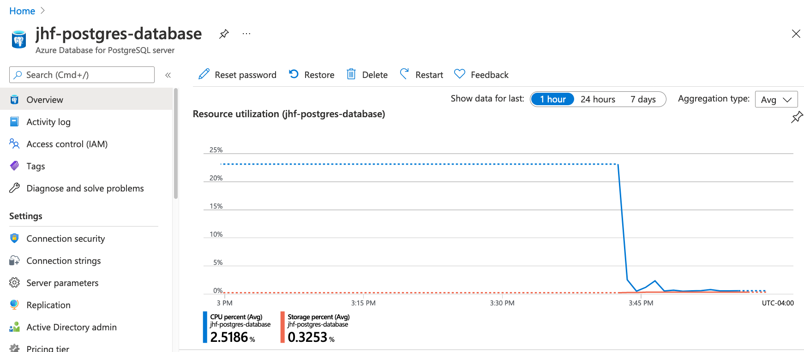
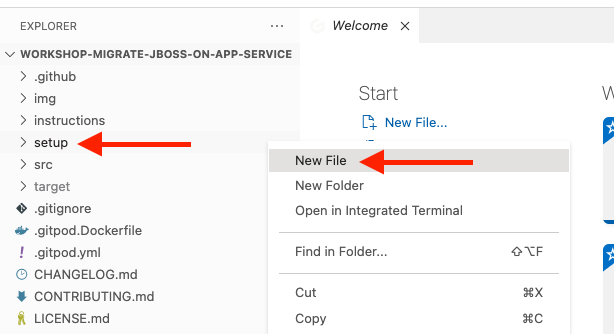
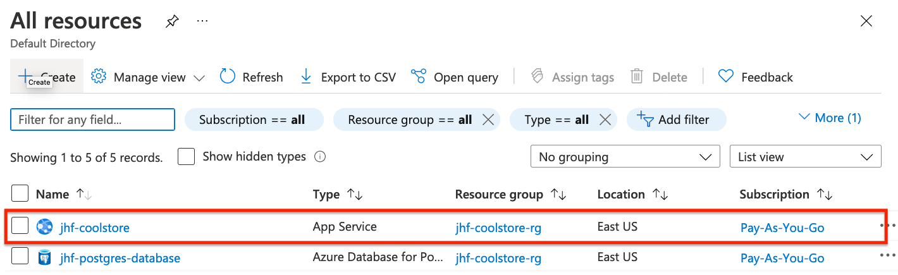
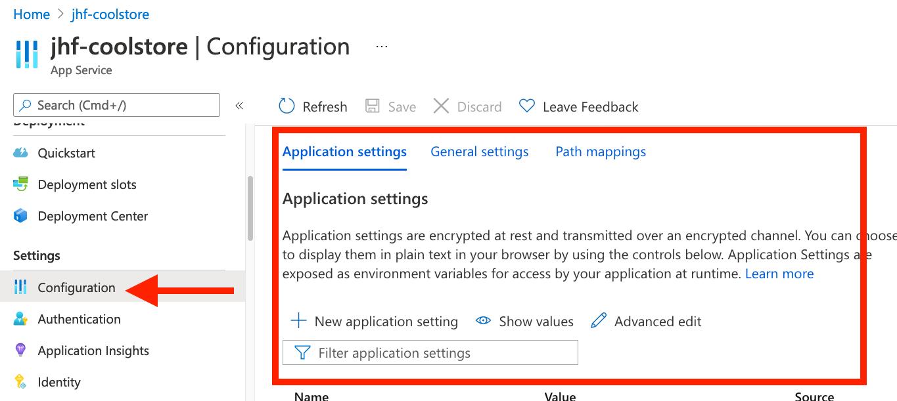
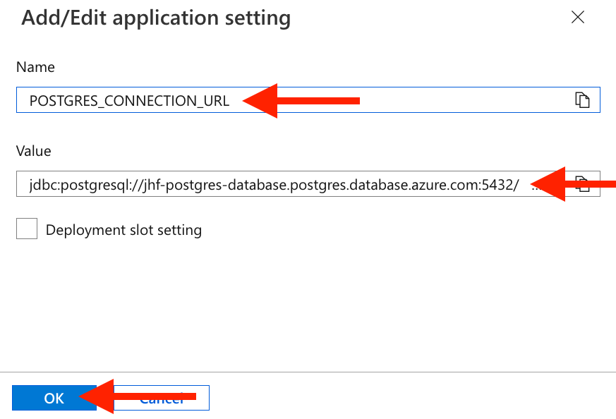
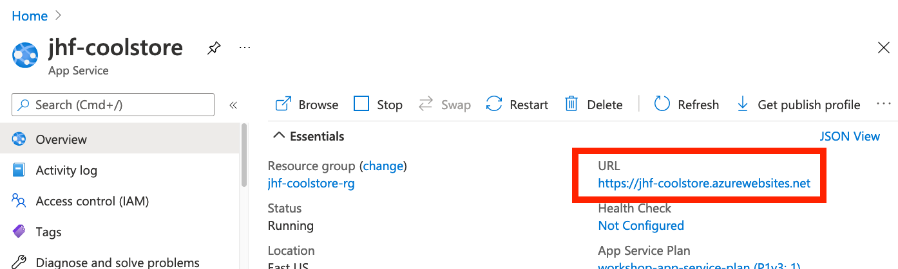
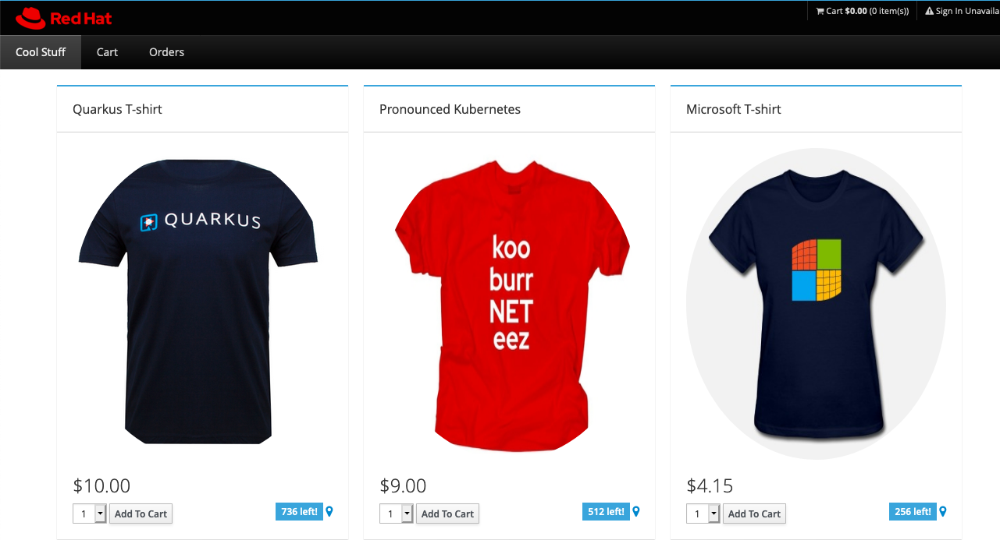

# Create and Configure PostgreSQL on Azure

In the previous exercise, you migrated a Jakarta EE app to JBoss EAP and ran it in your developer environment with a pre-provisioned database.

In this exercise we'll deploy [Azure Database for PostgreSQL](https://azure.microsoft.com/en-us/services/postgresql) and reconfigure our application to use it when deploying to our already-created Azure App Service instance of JBoss EAP.

## Overview of Postgres pricing tiers

Azure Database for PostgreSQL offers several options to meet your data needs.

*Single Server* is a preconfigured database server and is best for workloads where the database have minimal customization requirements. This is what we will use in today's workshop.

*Flexible Server* provides maximum control for your database with a simplified developer experience and is best for workloads that require things like custom maintenance windows, zone redunant high availability, and start/stop capabilities or burstable SKUs for cost optimization.

*Hyperscale* provides horizontal scale-out capability to hundreds of nodes and is best for high performance workloads that require dynamic scalability, or require transactional and analytical queries to run on the same database.

[Learn more about Azure Database for Postgres Pricing](https://azure.microsoft.com/en-us/pricing/details/postgresql/server/).

## Exercise: Create Postgres DB

You can create Postgres databases using the Azure Portal or Azure CLI. Let's use the Azure CLI. First, create an environment variable that will store the name of your database:

> **NOTE**: Replace **<your_name>** with a unique name (for example, the initials of your name) as this value must be unique for each user. We'll also set variables for the database username and password for later use (feel free to use different values for those, or just use the defaults below)

```bash
export SERVER_NAME=<your_name>-postgres-database
export DB_USERNAME=cooladmin
export DB_PASSWORD=EAPonAzure1
```

Then, to create the database service (using the default SKU and PostgreSQL version 11), run the following command:

```bash
az postgres server create --resource-group $RESOURCE_GROUP \
  --name $SERVER_NAME --location $LOCATION --admin-user $DB_USERNAME \
  --admin-password $DB_PASSWORD --sku-name GP_Gen5_2 --version 11
```

> **NOTE** This uses PostgreSQL version 11. If you need support for later versions, you'll need to deploy a Flexible Server or Hyperscale server!

This will take about 1 minute to complete.

Now we can use `az postgres server list` to save the full name of our database to an environment variable that we will use later. Run this command:

```bash
export SERVER_FQDN=$(az postgres server list |
  jq -r '.[] | select (.name == "'$SERVER_NAME'") |
  .fullyQualifiedDomainName') && echo $SERVER_FQDN
```

You should see the FQDN that looks like `<server_name>-.postgres.database.azure.com`.

Next, In the Azure Portal, navigate to _Home > All Resources_. You should see your Database in the list of recent resources (along with your JBoss EAP App Service). Click on the database to show various details about the service.



Next, we'll need to allow access to the database from services within Azure (like App Service, where our EAP app will eventually run). You can do that in the "Connection security" panel of the Azure Database blade by toggling the "Allow access to Azure services" button to the "ON" position and clicking **Save**. Alternatively, you can run the following CLI command:

```bash
 az postgres server firewall-rule create -g $RESOURCE_GROUP \
   -s $SERVER_NAME -n AllowAllWindowsAzureIps \
   --start-ip-address 0.0.0.0 --end-ip-address 0.0.0.0
```

Next, create a database named `monolith` within Postgres with this command:

```bash
az postgres db create -g $RESOURCE_GROUP -s $SERVER_NAME -n monolith
```

Now that we have the database, let's move on to configuring our App Service to use it!

## Configure EAP on App Service for Postgres

When EAP is deployed to App Service, it is deployed as a read-only image that isn't designed to be manually configured as you would a traditional on-prem EAP deployment, because if the service is restarted, those changes will disappear. But there is a _startup hook_ and a writeable filesystem (that does not reset between reboots) you can use to configure EAP with custom settings. We'll use this for our database configuration.

First, we need to create some files that will implement that hook, and upload it to our App Service.

In the IDE, right-click on the `setup` directory and choose **New File**:



Name the file `startup.sh`. In this file, add the following content:

```bash
#!/usr/bin/env bash

export SETUP_DIR=/home/site/libs
$JBOSS_HOME/bin/jboss-cli.sh --connect --file=${SETUP_DIR}/jboss-cli-commands.cli
```

This file refers to another file (`jboss-cli-commands.cli`) that we've already created for you that will add Postgres support to JBoss EAP using the JBoss CLI when it starts up. Feel free to look at this file to see what it does.

We'll also need the Postgres JDBC driver library. Run this command to fetch it into the same directory:

```bash
wget -O $GITPOD_REPO_ROOT/setup/postgresql.jar \
  https://jdbc.postgresql.org/download/postgresql-42.2.24.jar
```

Confirm it downloaded and is a JAR file:

```bash
file $GITPOD_REPO_ROOT/setup/postgresql.jar
```

It should report:

```
<path>/setup/postgresql.jar: Java archive data (JAR)
```
### Create Application Settings

The scripts above refer to a number of environment variables that must be set on the EAP App Service. On the Azure Portal, navigate to _Home > All Resources_ once again, and you should see your _App Service_ that you created earlier, alongside your Postgres Database.



Click on the App Service to get details about it. Under the _Settings_ category on the left, click on _Configuration_:



Here, you will need create 3 new settings. You can print out the values you'll need by running the following commands in a Terminal in your IDE:

```bash
echo "POSTGRES_CONNECTION_URL --> jdbc:postgresql://${SERVER_FQDN}:5432/monolith" && \
echo "POSTGRES_SERVER_ADMIN_FULL_NAME --> ${DB_USERNAME}@${SERVER_NAME}" && \
echo "POSTGRES_SERVER_ADMIN_PASSWORD --> $DB_PASSWORD"
```
Create a new Application Setting for each of the above by clicking on **New Application Setting** and filling in the values and clicking OK:



You can also use the `az` command line to accomplish the same thing:

```bash
az webapp config appsettings set -g $RESOURCE_GROUP -n $WEBAPP_NAME --settings \
  "POSTGRES_CONNECTION_URL=jdbc:postgresql://$SERVER_FQDN:5432/monolith" \
  "POSTGRES_SERVER_ADMIN_FULL_NAME=${DB_USERNAME}@${SERVER_NAME}" \
  "POSTGRES_SERVER_ADMIN_PASSWORD=$DB_PASSWORD"
```

These values will be read by the scripts and EAP to configure Postgres. To make this happen on startup, run the following commands to upload these files using the `az webapp deploy` command:

```bash
az webapp deploy --resource-group $RESOURCE_GROUP --name jhf-coolstore \
    --src-path $GITPOD_REPO_ROOT/setup/postgresql.jar  \
    --target-path /home/site/libs/postgresql.jar --type lib && \
\
az webapp deploy --resource-group $RESOURCE_GROUP --name jhf-coolstore \
    --src-path $GITPOD_REPO_ROOT/setup/jboss-cli-commands.cli  \
    --target-path /home/site/libs/jboss-cli-commands.cli --type lib && \
\
az webapp deploy --resource-group $RESOURCE_GROUP --name jhf-coolstore \
  --src-path $GITPOD_REPO_ROOT/setup/startup.sh  --type startup
```

The `--type` argument informs where the files are placed on the app service. This will also trigger the app to restart to apply the new configuration. We should now have a fully deployed EAP instance on App Service with support for PostgreSQL.

## Deploy Coolstore application to App Service

With our EAP App Service and Postgres database deployed, and EAP configured to enable Postgres, it's time to deploy the application. Re-build the application on last time by running this command:

```bash
mvn -f $GITPOD_REPO_ROOT clean package
```

This builds the application as a Jakarta EE web app (`.war` extension).

Finally, to deploy the application, run this:

```bash
az webapp deploy --resource-group $RESOURCE_GROUP \
  --name $WEBAPP_NAME \
  --src-path $GITPOD_REPO_ROOT/target/ROOT.war \
  --type war
```

> **NOTE** there are many different ways to deploy apps to EAP on App Service. You can also install the Azure plugin for various IDEs which can build and deploy Java apps, or you can use a the Azure Maven Plugin to accomplish the same.

## Check result

After a minute or so, the application will be deployed and ready. Visit the application's URL, which you can find on the Azure Portal at _Home > All Resources > <your_app_service>_:



Click on the URL, and you should now see the Coolstore application running on App Service:



> **NOTE**: You may see the default JBoss EAP landing page instead. This is usually caused by invalid or missing setup scripts, or invalid values for the Application Settings (connection URL, username or password). Double-check the values are correct and try to re-deploy the application again!

**Congratulations!** You now have deployed your migrated application to App Service. In the next section, we'll see about automating it so you don't have to manually deploy each time you wish to make a change.

---

⬅️ Previous section: [2 - Migrate a WebLogic app to JBoss EAP](2-migrate-weblogic-to-jboss.md)

➡️ Next section: [4 - Deploy with GitHub Actions](4-set-up-github-actions.md)

