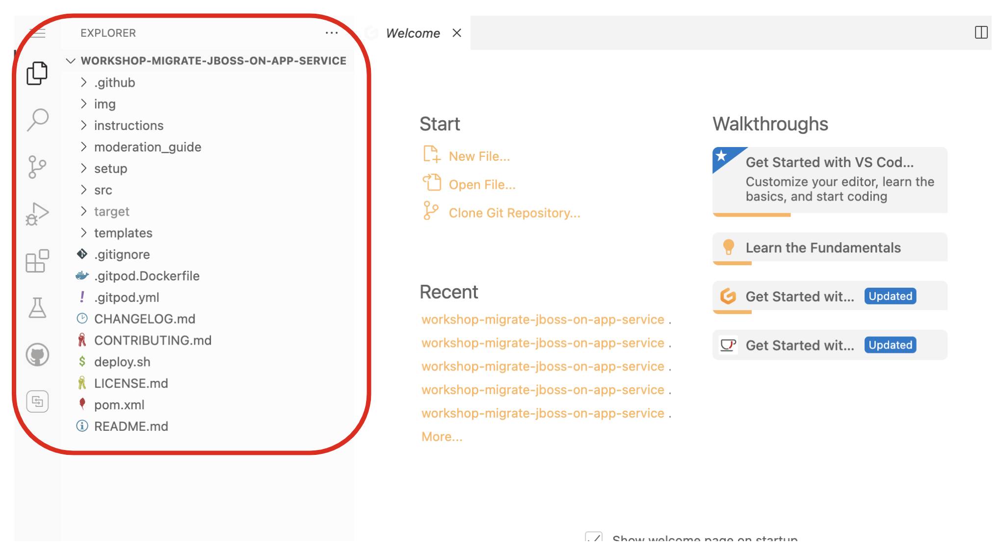
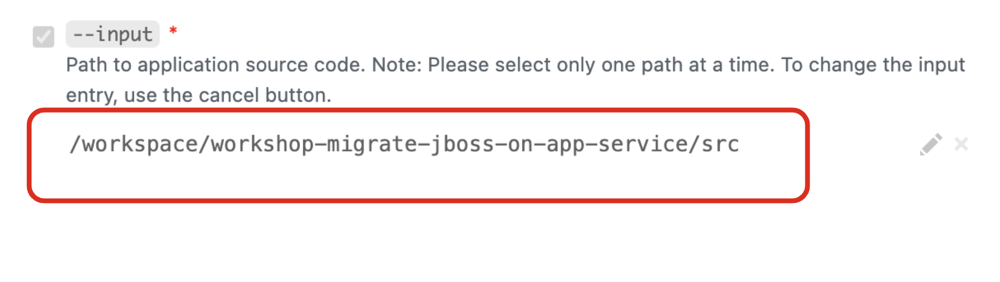
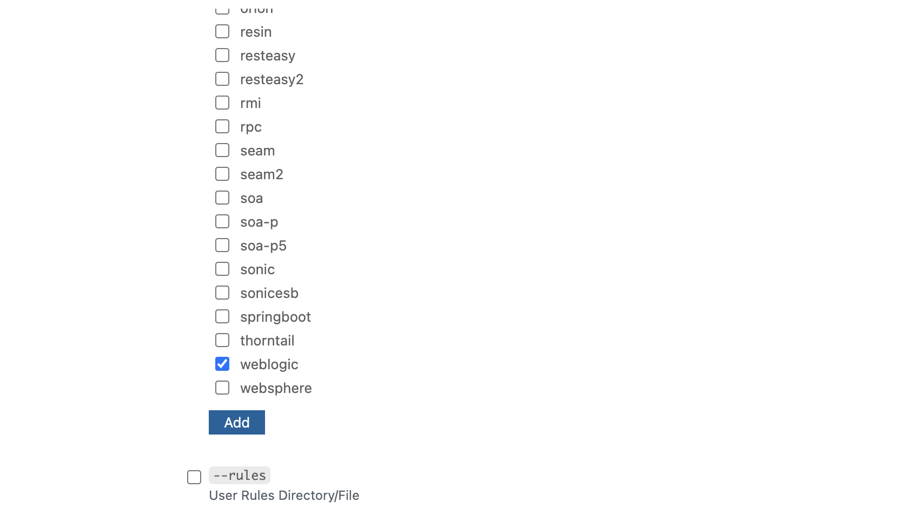
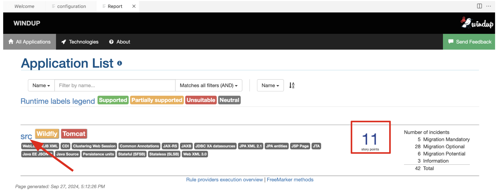
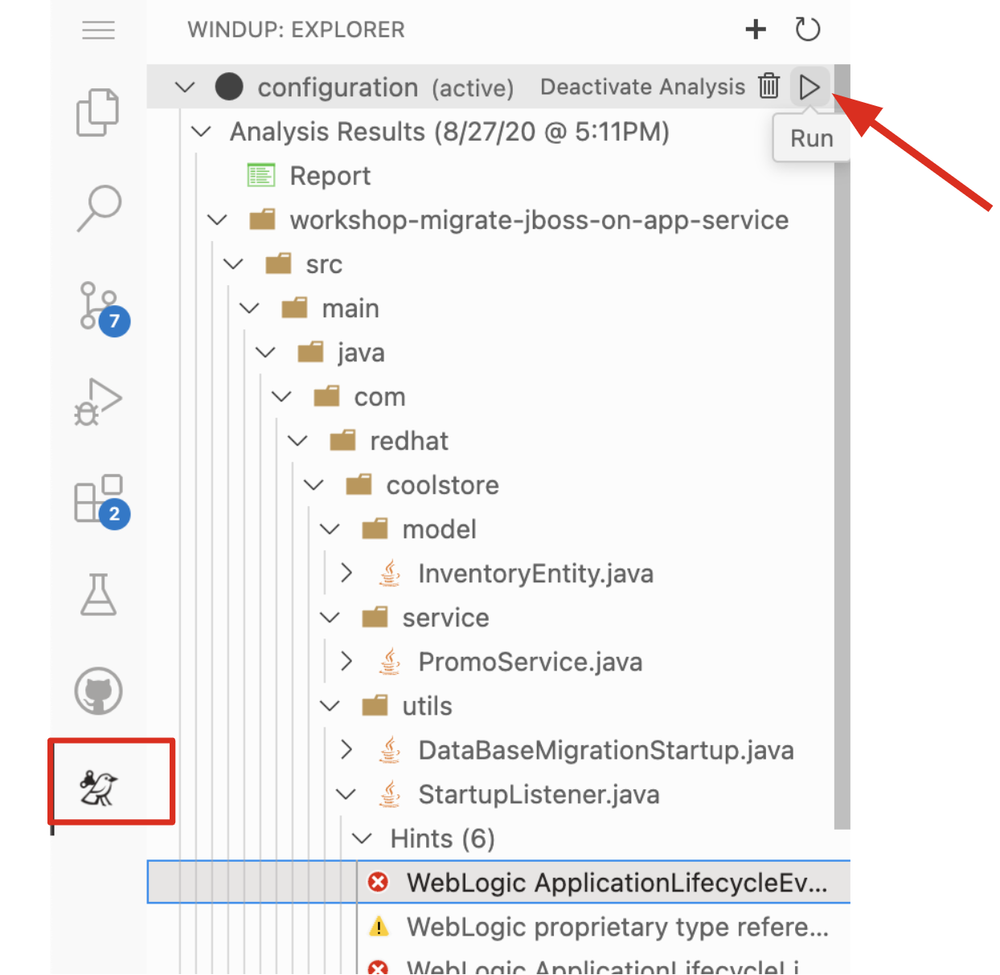

# 3 - Migrate WebLogic to JBoss

In this module you’ll work with an existing Java EE application designed for a retail store, _CoolStore_. The current version of the CoolStore is a Java EE application built for Oracle _WebLogic_ Application Server. As part of a modernization strategy you've decided to move this application to _JBoss EAP_.

## 3.1 - What is JBoss Enterprise Application Platform (JBoss EAP)?

[JBoss EAP](https://www.redhat.com/en/technologies/jboss-middleware/application-platform) is an open source platform for highly transactional, web-scale Java applications. JBoss EAP combines the familiar and popular Jakarta EE specifications with the latest technologies, like Eclipse MicroProfile, to modernize your applications from traditional Java EE into the new world of DevOps, cloud, containers, and microservices.

JBoss EAP includes everything needed to build, run, deploy, and manage enterprise Java applications in a variety of environments, including on-premise, virtual environments, and in private, public, and hybrid clouds.

More features and benefits of JBoss EAP are here:

* **Java certified** - Support the leading Java standards and specifications including Jakarta EE 8, Java SE 11 ([OpenJDK](https://developers.redhat.com/products/openjdk/overview) and Oracle JDK), and Eclipse MicroProfile.
* **Optimizing for the Cloud** - Highly efficient and optimized for container and cloud deployments including [Red Hat OpenShift](https://developers.redhat.com/products/openshift/overview). JBoss EAP offers an extremely low memory footprint, fast start-up times, and efficient resource utilization.
* **Modular and lightweight** - Provide a modular structure that allows service enabling only when required, improving startup speed to build a modern application platform.
* **Enterprise performance** - Provide a flexible web server, Undertow, as well as enterprise features such as failover, clustering, caching, intelligent load balancing, and distributed deployment performance-tuned for highly transactional applications.
* **Security** - Provide a security subsystem called Elytron, that provides a unified framework to manage and configure access for standalone servers and managed domains. It can also be used to configure security access for deployed applications.
* **Flexible management** - Provide a management console and CLI that provides administrators with a unified view into configurations, deployments, security, and subsystems as well as the ability to manage servers offline. The CLI can be used with popular configuration management tools, such as Red Hat Ansible or Puppet.
* **Developer productivity** - Provides tools to boost productivity and innovate faster with features like self-service application provisioning, simplified stack management, and application auto-scaling. It also supports continuous testing and integration technologies such as [Arquillian](https://arquillian.org/) for integration testing, Maven for automated and managed build processes, and Jenkins for continuous integration and continuous delivery.

JBoss EAP is based upon the popular open source project [WildFly](https://jbossorg.github.io/wildflysite/). The following JBoss EAP versions are based on these Wildfly versions.

| JBoss EAP Version      | Wildfly Version |
| ----------- | ----------- |
| 7.4      | 23       |
| 7.3      | 18       |
| 7.2      | 14       |
| 7.1      | 11       |
| 7.0      | 10       |

## 3.2 - What is the Migration Toolkit for Applications?

<p align="center">
    
</p>

__Migration Toolkit for Applications (MTA)__ is an extensible and customizable rule-based tool that helps simplify migration of Java applications.

It is used by organizations for:

* Planning and work estimation
* Identifying migration issues and providing solutions
* Detailed reporting
* Built-in rules and migration paths
* Rule extensibility and customization
* Ability to analyze source code or application archives

Read more about it in the [MTA documentation](https://access.redhat.com/documentation/en-us/migration_toolkit_for_applications/)

## 3.3 - Exercise: Analyze app using MTA IDE Plugin

In this step we will analyze a monolithic application built for use with Oracle WebLogic Server (WLS). This application is a Java EE application using a number of different technologies, including standard Java EE APIs as well as proprietary WebLogic APIs and best practices.

For this lab, we will use the MTA [IDE Plugin](https://access.redhat.com/documentation/en-us/migration_toolkit_for_applications/5.1/html-single/ide_plugin_guide/index) based on [Gitpod](https://www.gitpod.io/docs/).

The IDE Plugin for the Migration Toolkit for Applications provides assistance directly in Gitpod for developers making changes for a migration or modernization effort. It analyzes your projects using MTA, marks migration issues in the source code, provides guidance to fix the issues, and offers automatic code replacement when possible.

### 3.3.1 - Access Your Development Environment

----

You will be using Gitpod, a cloud-powered development environments based on [Visual Studio Code](https://code.visualstudio.com/) including the code editor, terminal, debugger, settings sync, and any extension. __Changes to files are auto-saved every few seconds__, so you don’t need to explicitly save changes.

You already started your IDE in a previous step, and you can see that the project is imported into your workspace and is visible in the project explorer:

<p align="center">
    
</p>

You can see icons on the left for navigating between project explorer, search, source control  (e.g. Git), debugging, and other plugins. You’ll use these during the course of this workshop. Feel free to click on them and see what they do:

<p align="center">
    
</p>

### 3.3.2 - Use the configuration editor to setup the analysis

----

Click on `MTA Explorer` icon on the left, you will see a new MTA configuration is automatically added. To input source files and directories, click on `Add` then select `Open File Explorer`:

<p align="center">

</p>

The current working directory `/workspace/workshop-migrate-jboss-on-app-service/` will be shown. Then click on `src` directory and click on `Enter`:

<p align="center">

</p>

Then you will see that `/workspace/workshop-migrate-jboss-on-app-service/src/` directory is added in _--input_ configuration.

Find and select `eap7` in _--target_ server to migrate:

<p align="center">

</p>

Find and click on the `--source` checkbox then select `weblogic` to indicate that the Weblogic-specific rules should be used. Leave the other configuration values as-is:

<p align="center">

</p>

### 3.3.3 - Run an analysis report

----

Right-click on *mtaConfiguration* to analyze the WebLogic application. Click on `Run` in the popup menu:

<p align="center">

</p>

Migration Toolkit for Applications (MTA) CLI will be executed automatically in a new terminal in GitPod and it will take a minute or less to complete the analysis. Once it's done, click on `Open Report` in the pop-up:

<p align="center">

</p>

### 3.3.4 - Review the report

----

<p align="center">

</p>

The main landing page of the report lists the applications that were processed. Each row contains a high-level overview of the story points, number of incidents, and technologies encountered in that application.

**Click on the `src` link** to access details for the project:

<p align="center">

</p>

### 3.3.5 - Understanding the report

----

The Dashboard gives an overview of the entire application migration effort. It summarizes:

* The incidents and story points by category
* The incidents and story points by level of effort of the suggested changes
* The incidents by package

**_NOTE:_** Story points are an abstract metric commonly used in Agile software development to estimate the relative level of effort needed to implement a feature or change. Migration Toolkit for Application uses story points to express the level of effort needed to migrate particular application constructs, and the application as a whole. The level of effort will vary greatly depending on the size and complexity of the application(s) to migrate.

You can use this report to estimate how easy/hard each app is, and make decisions about which apps to migrate, which to refactor, and which to leave alone. In this case we will do a straight migration to JBoss EAP.

On to the next step to change the code!

## 3.4 - Exercise: Migrate your application to JBoss EAP

In this step you will migrate some WebLogic-specific code in the app to use standard (Jakarta EE) interfaces.

### 3.4.1 - Jump to Code

----

Let's jump to code containing identified migration issues. Expand the **workshop-migrate-jboss-on-app-service** source project in the _Migration Toolkit for Applications_ and navigate to `workshop-migrate-jboss-on-app-service > src > main > java > com > redhat > coolstore > utils > StartupListener.java`. Be sure to click the arrow next to the actual class name `StartupListener.java` to expand and show the Hints:

**_TIP:_** You can use [CTRL+p] (or [CMD+p] on macOS) to quickly open a file. Simply start typing the name of the file in the text box that appears and select your file from the list that is produced.

<p align="center">

</p>

In the Explorer, MTA issues use an icon to indicate their severity level and status. The following table describes the meaning of the various icons:

<p align="center">

</p>

### 3.4.2 - View Details about the Migration Issues

----

Let's take a look at the details about the migration issue. Right-click on `WebLogic ApplicationLifecycleListener[rule-id:xxx]` in _Hints_ of _StartupListener.java_ file. Click on `View Details`:

<p align="center">

</p>

MTA also provides helpful links to understand the issue deeper and offer guidance for the migration when you click on `Open Report`:

<p align="center">

</p>

The WebLogic `ApplicationLifecycleListener` abstract class is used to perform functions or schedule jobs in Oracle WebLogic, like server start and stop. In this case we have code in the `postStart` and `preStop` methods which are executed after WebLogic starts up and before it shuts down, respectively.

In Jakarta EE, there is no equivalent to intercept these events so the _ApplicationLifecycleListener_ need to be removed. Instead, you can get equivalent functionality using a _Singleton EJB_ with standard annotations, as suggested in the issue in the MTA report. 

We will use the `@Startup` annotation to tell the container to initialize the singleton session bean at application start. We will similarly use the `@PostConstruct` and `@PreDestroy` annotations to specify the methods to invoke at the start and end of the application lifecycle achieving the same result but without using proprietary interfaces.

Using this method makes the code much more portable.

### 3.4.3 - Fix the ApplicationLifecycleListener issues

----

In this section we're going to deal with the following two issues from the report:

<p align="center">

</p>

To begin we are fixing the issues under the Monolith application. Right-click on `WebLogic ApplicationLifecycleListener[rule-id:xxx]` in _Hints_ of _StartupListener.java_ file. Click on `Open Code`:

<p align="center">

</p>

Open the file `src/main/java/com/redhat/coolstore/utils/StartupListener.java` by clicking on it.

Replace the file content with:

```java
package com.redhat.coolstore.utils;

import javax.annotation.PostConstruct;
import javax.annotation.PreDestroy;
import javax.ejb.Startup;
import javax.inject.Singleton;
import javax.inject.Inject;
import java.util.logging.Logger;

@Singleton
@Startup
public class StartupListener {

    @Inject
    Logger log;

    @PostConstruct
    public void postStart() {
        log.info("AppListener(postStart)");
    }

    @PreDestroy
    public void preStop() {
        log.info("AppListener(preStop)");
    }

}
```

**_NOTE:_** Where is the Save button? Gitpod will __autosave__ your changes, that is why you can’t find a SAVE button - no more losing code because you forgot to save. You can undo with `CTRL-Z` (or `CMD-Z` on a macOS) or by using the `Edit -> Undo` menu option.

### 3.4.4 - Test the build

----

In the GitPod terminal, run the following command to test the build:

```shell
mvn -f $GITPOD_REPO_ROOT clean package
```

<p align="center">

</p>

If it builds successfully (you will see `BUILD SUCCESS`), let’s move on to the next issue! If it does not compile, verify you made all the changes correctly and try the build again.

<p align="center">

</p>

### 3.4.5 - View the diffs

You can review the changes you've made. On the left, click on the _Source Control_ icon, which shows a list of the changed files. Click on `StartupListener.java` to view the differences you've made:

<p align="center">

</p>

Git keeps track of the changes you make, and you can use source control  to check in, update, and compare files as you change them.

For now, go back to the _Explorer_ tree and lets fix the remaining issues.

### 3.4.6 - Fix the logger issues

----

In this section we'll be looking to remediate this part of the migration report:

<p align="center">

</p>

Some of our application makes use of WebLogic-specific logging methods like the `PromoService`, which offer features related to logging of internationalized content, and client-server logging.

The WebLogic `PromoService` is not supported on JBoss EAP (or any other Java EE platform), and should be migrated to a supported logging framework, such as the JDK Logger or JBoss Logging.

We will use the standard Java Logging framework, a much more portable framework. The framework also [supports internationalization](https://docs.oracle.com/javase/8/docs/technotes/guides/logging/overview.html#a1.17) if needed.

Open the `src/main/java/com/redhat/coolstore/service/PromoService.java` file and replace its contents with:

```java
package com.redhat.coolstore.service;

import java.io.Serializable;
import java.util.HashMap;
import java.util.HashSet;
import java.util.Map;
import java.util.Set;

import javax.enterprise.context.ApplicationScoped;

import com.redhat.coolstore.model.Promotion;
import com.redhat.coolstore.model.ShoppingCart;
import com.redhat.coolstore.model.ShoppingCartItem;

import java.util.logging.Logger;

@ApplicationScoped
public class PromoService implements Serializable {

    private Logger log = Logger.getLogger(PromoService.class.getName());

    private static final long serialVersionUID = 2088590587856645568L;

    private String name = null;

    private Set<Promotion> promotionSet = null;

    public PromoService() {

        promotionSet = new HashSet<>();

        log.info("Adding new promotion");
        promotionSet.add(new Promotion("329299", .25));

    }

    public void applyCartItemPromotions(ShoppingCart shoppingCart) {

        if (shoppingCart != null && shoppingCart.getShoppingCartItemList().size() > 0) {

            Map<String, Promotion> promoMap = new HashMap<String, Promotion>();

            for (Promotion promo : getPromotions()) {

                promoMap.put(promo.getItemId(), promo);

            }

            for (ShoppingCartItem sci : shoppingCart.getShoppingCartItemList()) {

                String productId = sci.getProduct().getItemId();

                Promotion promo = promoMap.get(productId);

                if (promo != null) {

                    sci.setPromoSavings(sci.getProduct().getPrice() * promo.getPercentOff() * -1);
                    sci.setPrice(sci.getProduct().getPrice() * (1 - promo.getPercentOff()));

                }

            }

        }

    }

    public void applyShippingPromotions(ShoppingCart shoppingCart) {

        if (shoppingCart != null) {

            //PROMO: if cart total is greater than 75, free shipping
            if (shoppingCart.getCartItemTotal() >= 75) {

                shoppingCart.setShippingPromoSavings(shoppingCart.getShippingTotal() * -1);
                shoppingCart.setShippingTotal(0);

            }

        }

    }

    public Set<Promotion> getPromotions() {

        if (promotionSet == null) {

            promotionSet = new HashSet<>();

        }

        return new HashSet<>(promotionSet);

    }

    public void setPromotions(Set<Promotion> promotionSet) {

        if (promotionSet != null) {

            this.promotionSet = new HashSet<>(promotionSet);

        } else {

            this.promotionSet = new HashSet<>();

        }

    }

    @Override
    public String toString() {
        return "PromoService [name=" + name + ", promotionSet=" + promotionSet + "]";
    }

}
```

That one was pretty easy.

### 3.4.7 - Test the build

----

Build and package the app again just as before:

```shell
mvn -f $GITPOD_REPO_ROOT clean package
```

If builds successfully (you will see `BUILD SUCCESS`), then let’s move on to the next issue! If it does not compile, verify you made all the changes correctly and try the build again.

### 3.4.8 - Remove the WebLogic EJB Descriptors

----

In this and the following few sections we'll be addressing this part of the report:

<p align="center">

</p>

Much of WebLogic’s interfaces for EJB components like MDBs reside in WebLogic descriptor XML files. Use `CTRL+p` (or `CMD+p` on a macOS) to quickly open
`src/main/webapp/WEB-INF/weblogic-ejb-jar.xml` to see one of these descriptors. There are many different configuration possibilities for EJBs and MDBs in this file, but luckily our application only uses one of them, namely it configures `<trans-timeout-seconds>` to 30, which means that if a given transaction within an MDB operation takes too long to complete (over 30 seconds), then the transaction is rolled back and exceptions are thrown. This interface is WebLogic-specific so we’ll
need to find an equivalent in JBoss.

Remove the unneeded `weblogic-ejb-jar.xml` file from the **Project Explorer** (not the **MTA Explorer**). This file is proprietary to WebLogic and not recognized or processed by JBoss EAP. Delete the file by right-clicking on the `src/main/webapp/WEB-INF/weblogic-ejb-jar.xml` file from the **Project Explorer** and choosing **Delete**, and click **OK**.

> **_TIP:_** If you have the tab for the `weblogic-ejb-jar.xml` file open (or handy) you can quickly find it in the Project Explorer by right-clicking on the tab and then selecting **Reveal in Explorer** as shown.

<p align="center">

</p>

While we’re at it, let’s remove the stub weblogic implementation classes added as part of the scenario.

Whilst still in the Project Explorer, right-click on the `src/main/java/weblogic` folder and select *Delete* to delete the folder:

<p align="center">

</p>

### 3.4.9 - Fix the code

----

Lastly, remove Maven dependency on **org.jboss.spec.javax.rmi:jboss-rmi-api_1.0_spec**. In JBoss EAP 7.3 (or later), artifact with groupId _org.jboss.spec.javax.rmi_ and artifactId _jboss-rmi-api_1.0_spec_ are unsupported dependencies. Remove the following dependency in `pom.xml`:

<p align="center">

</p>

### 3.4.10 - Test the build

----

Build once again:

```shell
mvn -f $GITPOD_REPO_ROOT clean package
```

If builds successfully (you will see `BUILD SUCCESS`). If it does not compile, verify you made all the changes correctly and try the build again.

### 3.4.11 - Re-run the MTA report

----

In this step we will re-run the MTA report to verify our migration was successful.

In the _Migration Toolkit for Applications_, right-click on *mtaConfiguration* to analyze the WebLogic application once again. Click on `Run` in the popup menu:

<p align="center">

</p>

Migration Toolkit for Applications (MTA) CLI will be executed automatically in a new terminal in GitPod then it will take less than a minute to complete the analysis. Click on `Open Report`:

<p align="center">

</p>

### 3.4.12 - View the results

----

Click on the latest result to go to the report web page and verify that it now reports 0 Story Points:

You have successfully migrated this app to JBoss EAP, congratulations!

<p align="center">

</p>

**_NOTE:_** You should be aware that this type of migration is more involved than the previous steps, and in real world applications it will rarely be as simple as changing one line at a time for a migration. Consult the [MTA documentation](https://access.redhat.com/documentation/en-us/migration_toolkit_for_applications/) for more
detail on Red Hat’s Application Migration strategies or contact your local Red Hat representative to learn more about how Red Hat can help you on your migration path.

### 3.4.13 - Test the application on JBoss EAP locally

----

In this development environment (GitPod), a JBoss EAP server is already running with a PostgreSQL database. Click on `Start Wildfly server` terminal in GitPod, take a look at if the EAP server is running properly:

<p align="center">

</p>

Copy the packaged application (.war file) to the running EAP server. Run the following command in the `Pre-warm Maven` terminal in GitPod:

```shell
cp $GITPOD_REPO_ROOT/target/ROOT.war /workspace/deployments/
```

Go back to the `Start Wildfly server` terminal in GitPod where EAP was started for you, and you'll see `ROOT.war` is deployed:

<p align="center">

</p>

> **Hint:** If you accidentally closed the terminal that was running Wildfly, you can restart Wildfly with `$JBOSS_HOME/bin/standalone.sh -b 0.0.0.0`

You can also find out that the inventory data is created in PostgreSQL. Run the following `psql` command in the GitPod Terminal:

```shell
PGPASSWORD=coolstore123 psql -h localhost -U coolstore monolith -c 'select itemid, quantity from INVENTORY;'
```

The output should look like:

```text
 itemid | quantity
--------+----------
 329299 |      736
 329199 |      512
 165613 |      256
 165614 |       54
 165954 |       87
 444434 |      443
 444435 |      600
 444436 |      230
 444437 |      300
(9 rows)
```

## 3.5 - Summary

Let's open a simple browser then access the application. Click on `Remote Explorer` on the left, you will see open ports. Then, click on `Open Browser` icon next to port `8080` (the default web server port for JBoss EAP):

<p align="center">

</p>

It will open a new web browser to showcase the CoolStore web app:

<p align="center">

</p>

Now that you have migrated an existing Java EE app on JBoss EAP, you are ready to start modernizing the application by deploying it on Azure App Service in incremental steps, and employing modern techniques to ensure the application runs well in a distributed and cloud environment.

----

⬅️ Previous section: [2 - Learn about Azure App Service](2-learn-about-app-service.md)

➡️ Next section: [4 - Create and Configure PostgreSQL on Azure](4-create-postgres-on-azure.md)
