# 5 - Deploy with GitHub Actions

## 5.1 - Overview of GitHub Actions

GitHub Actions help you automate tasks within your software development life cycle. GitHub Actions are event-driven, meaning that you can run a series of commands after a specified event has occurred. For example, every time someone creates a pull request for a repository, you can automatically run a command that executes a software testing script. GitHub Actions is based on `.yaml` files in the `.github/workflows/` directory of your application which describe the automation to be run. Let's learn more about the terminology and hierarchy of GitHub Actions...

### 5.1.1 - GitHub Actions Terminology

The first step in getting started with GitHub Actions is to create a **workflow file** in the `.github/workflows/` directory of your repository. The workflow file is composed of one or more **jobs**, and jobs are composed of one or more **steps**. The diagram below illustrates the hierarchy of these terms:

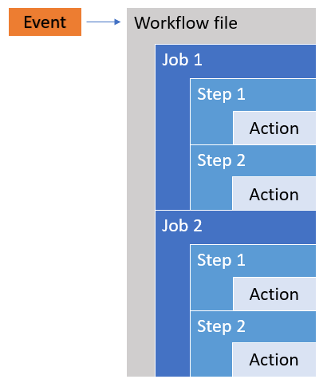

- **Events**: All workflows are triggered by events, whether that's a opening or closing Pull Request, pushing a commit, creating a release, or by a cron schedule. You can also filter the events, such as only triggering a workflow for commits on a specified branch, or if a commit makes changes in a specific directory.
- **Workflows**: The workflow file defines the events that trigger the workflow, the name of the workflow, and the
- **Jobs**: A job is a set of steps that execute on the same runner. By default, a workflow with multiple jobs will run those jobs in parallel. You can also configure a workflow to run jobs sequentially. For example, a workflow can have two sequential jobs that build and test code, where the test job is dependent on the status of the build job. If the build job fails, the test job will not run.
- **Steps**: A step is an individual task that can run commands in a job. A step can be either an **action** or a shell command. Each step in a job executes on the same runner, allowing the actions in that job to share data with each other.
- **Actions**: Actions are standalone commands that are combined into steps to create a job. Actions are the smallest portable building block of a workflow. You can create your own actions, or use actions created by the GitHub community. To use an action in a workflow, you must include it as a step.

### 5.1.2 - Example workflow

This is a simple example workflow that is triggered whenever a pull request is opened, and whenever a new commit is pushed to an open PR.

```yaml
name: CI for Pull Requests

on:
  pull_request:

jobs:
  build:
    runs-on: ubuntu-latest

    steps:
    - name: Checkout the repo
      uses: actions/checkout@v2

    - name: Set up Java 11
      uses: actions/setup-java@v2
      with:
        java-version: 11

    - name: Build application and run tests
      run: mvn clean install
```

## 5.2 - Exercise: Add a CI workflow for Pull Requests

To get introduced to GitHub Actions, let's set up some simple CI checks for your repository. Create a workflow file in your repository that runs whenever a PR is opened for the main branch and whenever a commit is pushed to the main branch. The workflow should run set up Java 11 and use Maven to build the application, essentially adding minimal CI checks to the repo.

To accomplish this task you can go to the **Actions** tab of your fork (on github.com):

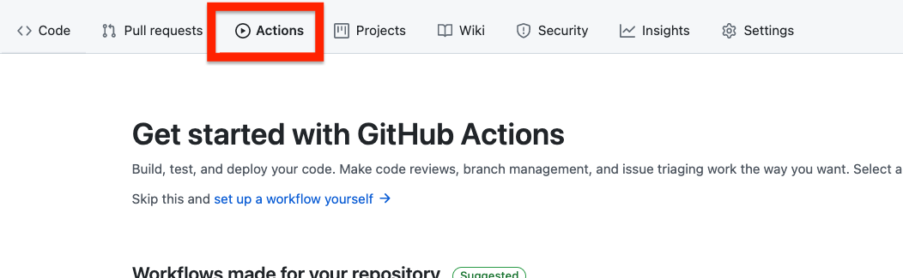

Under the **Workflows made for your repository** section (or possibly the **Continuous Integration Workflows** section), there will be a template workflow titled, **Java with Maven** (you may need to click the _More Continuous Integration Workflows_ button to expand the list). Once you find **Java with Maven**, click **Set up this workflow** to enter the in-browser editor to get the workflow set up.

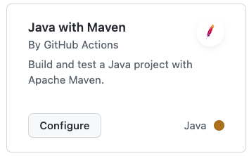

Review the file's contents, then click **Start commit**, enter a comment, then click **Commit new file**:

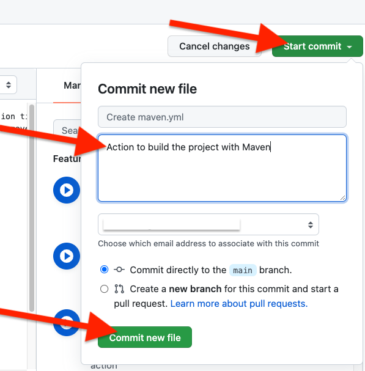

With the workflow setup, head back to the **Actions** tab and you will see that the workflow ran once already (when you committed the file just now). Click on the name of the workflow to see workflow details:

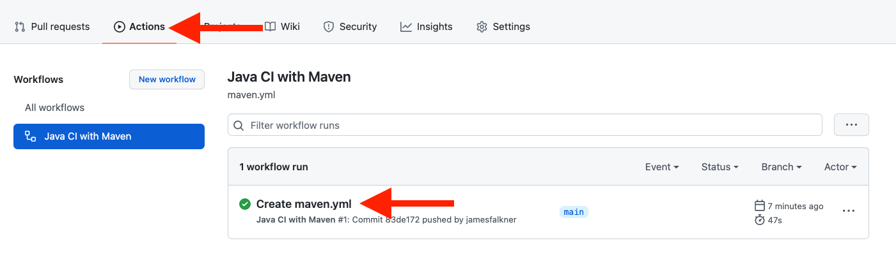

Details are shown, including the _build_ Job that was run. Click on the build job to see the output from the various steps taken during the run:

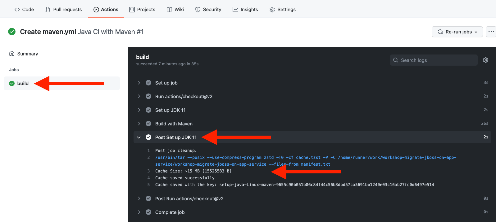

## 5.3 - Exercise: Add a workflow to deploy your application

Now that we have a simple CI workflow to build and test our application for Pull Requests, let's add another workflow file to build and *deploy* our Cool Store application to JBoss EAP on App Service whenever there is a commit on the main branch.

To do that, we'll use App Service and it's ability to _automatically_ create GitHub Actions in our fork for us, along with the needed setup of secrets, hostnames, etc.

On the Azure Portal, navigate back to your App Service application (_Home > All Resources > Your App Service_), and click on the **Deployment Center**. Under _Settings_, click to select **GitHub** as shown:

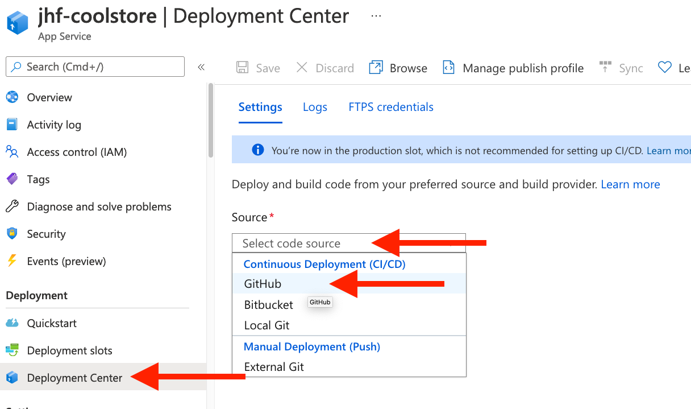

You will need to authorize App Service to be able to create files in your fork on your behalf, so click the **Authorize** button and follow the instructions to log into github and grant access.

Once authorized, back on the Azure Portal, continue to select the correct Organization (your personal GitHub organization), and the repository that you're using as your fork for this workshop. Select the `main` branch, select the **Add a Workflow** option, and confirm that the _Build_ section lists Java 11 and JBoss EAP:

**_NOTE:_** It may take time to retrieve all repositories in your personal GitHub organization. You might need to reload the page if you don't see _workshop-migrate-jboss-on-app-service_ repository in the select box.

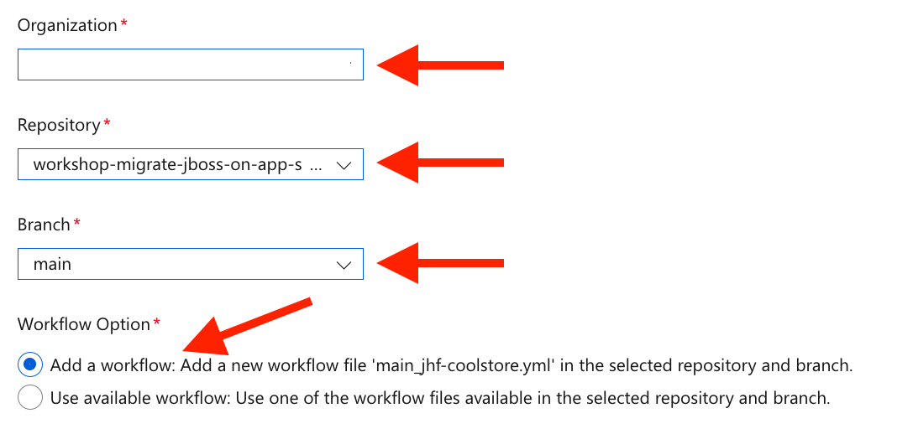

Click **Preview file** to see what the newly created file will look like:

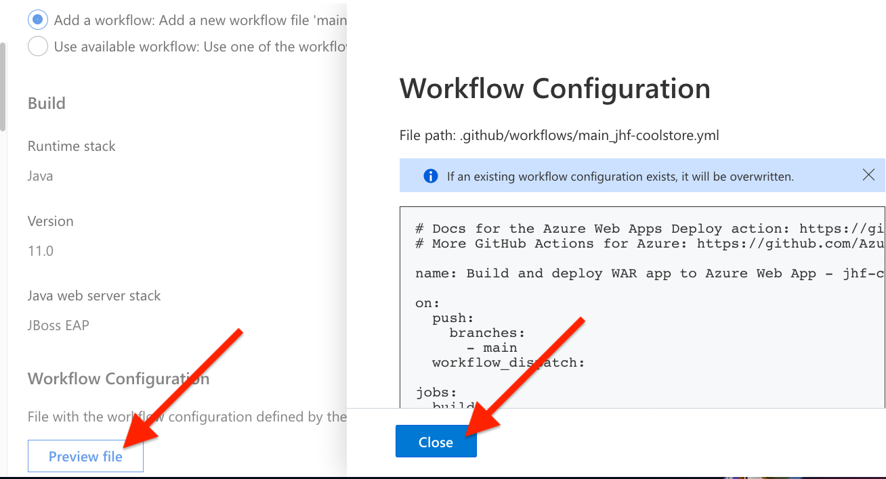

This action will:

- Checkout the latest revision of the code
- Build it with `mvn clean install`
- Deploy it to our existing JBoss EAP App service with the `azure/webapps-deploy` action using the secrets created as part of this process

Finally, click **Save** at the top:

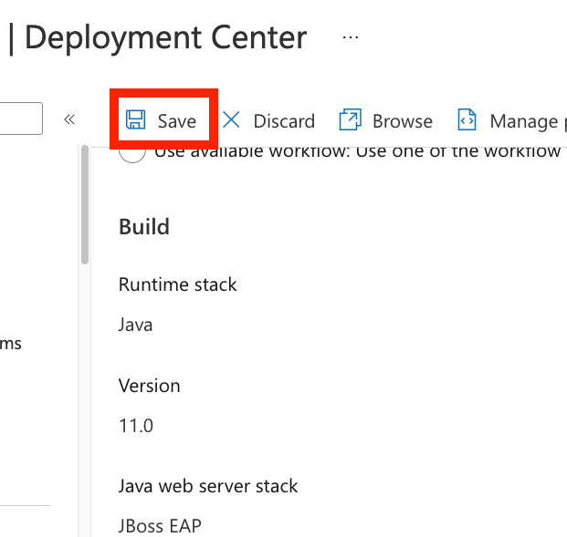

The actions file (and associated secrets) are then pushed into your repository, which can be seen back on your fork on github.com.

This will also trigger the action to deploy your app to App Service. Click on the **Actions** tab on your fork and check it out (you will see your existing action as well as the new one):

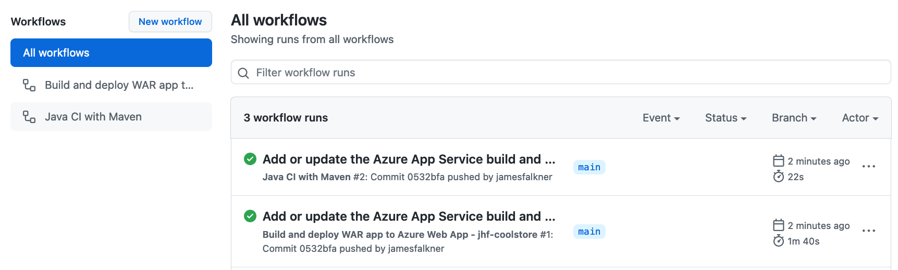

If you click on the new action to watch its progress, you can see the steps and output from the build and deploy:

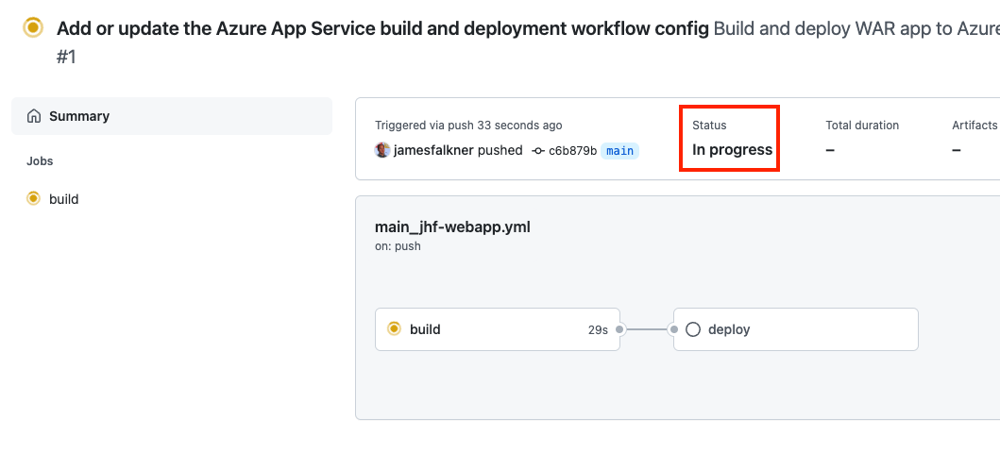

Wait for it to complete:

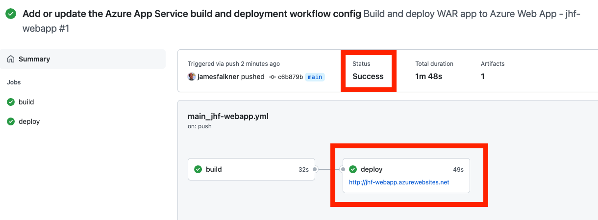

## 5.4 - Test your application

Once the GitHub action completes, after a minute or so, the application will be deployed and ready! Visit the application's URL, which you can find in the above output from GitHub Actions or on the Azure Portal at _Home > All Resources > <your_app_service> > Overview_:

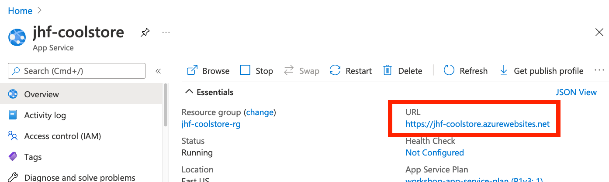

Click on the URL, and you should now see the Coolstore application running on App Service:

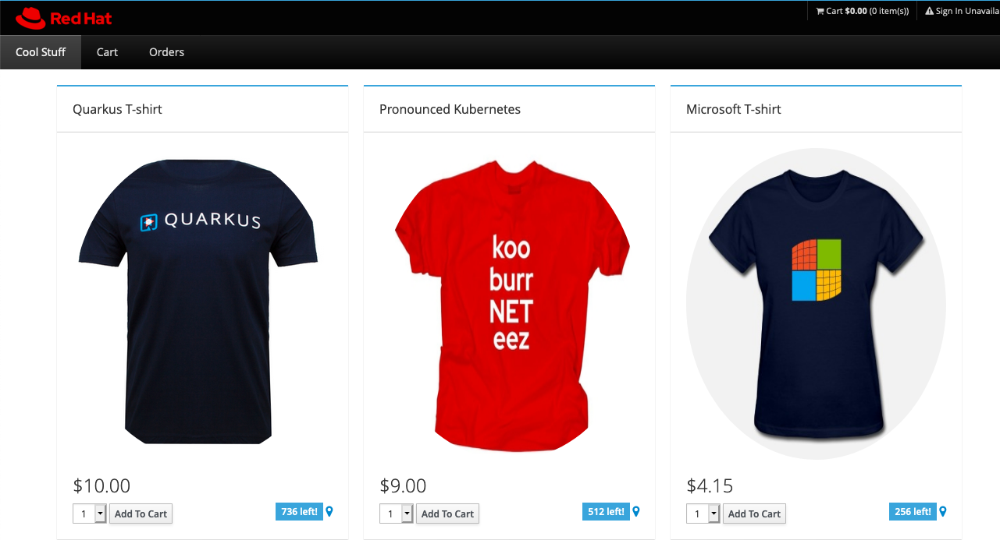

> **NOTE**: You may see the default JBoss EAP landing page instead. It may take a few minutes for the app to deploy and be ready, so just give it a minute before refreshing. If you still don't see the app, check for invalid or missing setup scripts, or invalid values for the Application Settings (connection URL, username or password) from prior exercises. Double-check the values are correct and try to re-deploy the application again!

> **NOTE**: You can manually trigger another workflow run by clicking on the **Actions** tab, then clicking on the action you wish to re-run, and finally click on **Re-run jobs** and selecting **Re-run all jobs**:

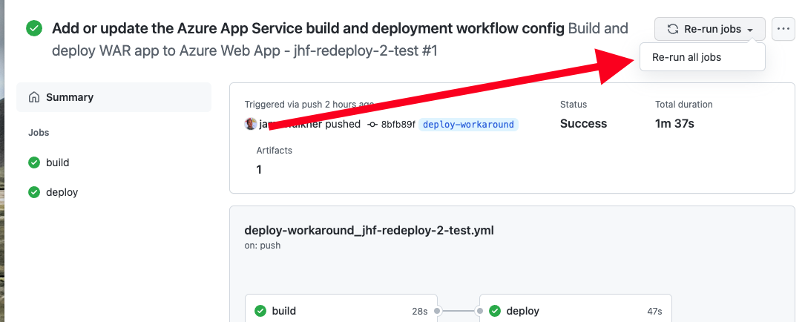

## 5.5 - Exercise: Make a code change and see it automatically deployed

Let's exercise our Action by making a code change and committing it, to trigger another workflow run. Head back to your developer CLI. The first thing to do is to update our local source to reflect the changes that we made via github.com and the Azure Portal. On the _Source Control_ page, click on the sub-menu and select **Pull** to pull in all of those changes we made outside our IDE.

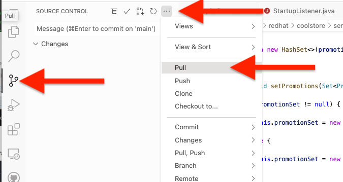

If you go back to the _File Explorer_ page you can see the new files under the `.github/workflows` directory:

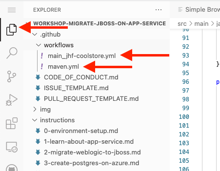

Now, let's change the color of the header bar of our application from black to _bisque_. Open the file `src/main/webapp/app/css/coolstore.css`. Add the following to the bottom of the file:

```css
.navbar-header {
    background: bisque
}
```

With our GitHub action in place, all we need to do is commit and push this change into our fork. Follow the same steps as before. Click on the _Source Control_ page, stage the file:

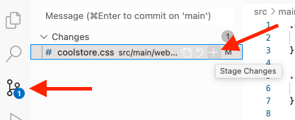

Enter a comment and CMD-ENTER (or CTRL-ENTER on Windows) to commit it:

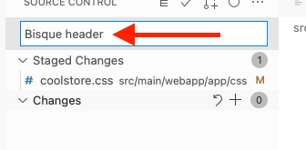

Then use the menu to _push_ it to your fork:

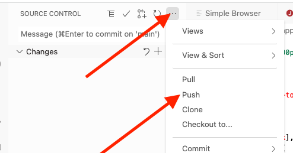

You can then watch the action run on your github.com fork on the **Actions** tab.

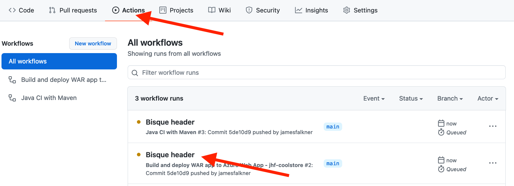

Once the action builds and deploys the new app to App Service (it may take a minute or two!),
re-visit your running app via its URL and it should now be sporting your new bisque header:

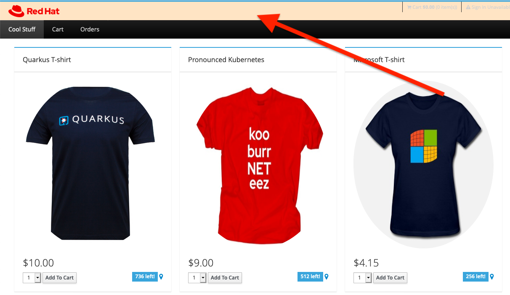

**Congratulations!** In this exercise you setup GitHub Actions to provide basic checks for your app when developers make changes, and created another Action to deploy those changes to your Azure App Service with JBoss EAP. You then deployed your app, and made a change, and watched the GitHub Action automate the redeployment. In the next section we'll explore how you can provide greater scale and security for your applications using _App Service Environments_.

---

⬅️ Previous section: [4 - Create PostgreSQL on Azure](4-create-postgres-on-azure.md)

➡️ Next section: [6 - Create an App Service Environment](6-app-service-environment.md)
