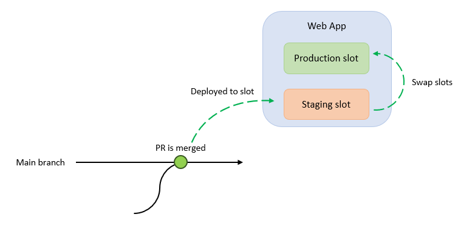
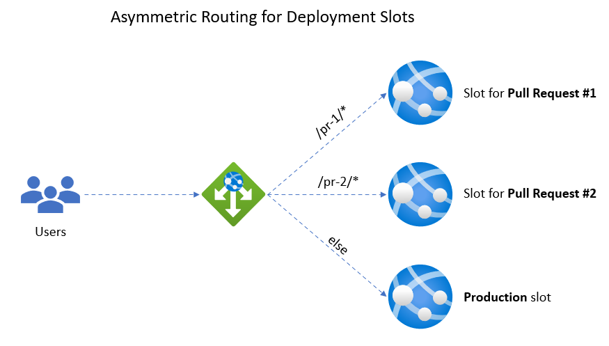

# 7 - Stage deployments for testing

As the saying goes, *"Friends don't let friends deploy directly to production"*... but until now that's exactly what we have been doing! In this section, you will set up GitHub Actions workflows to deploy your apps to a staging environment on our App Service Environment so that you can test and confirm your new build is running properly before promoting it to production.

## 7.1 - App Service Deployment Slots

App Service has a feature known as [Deployment Slots](https://docs.microsoft.com/azure/app-service/deploy-staging-slots), which are independent staging environments with their own configuration and file system. This means you can safely deploy your new releases to these slots, connect them to non-production services (such as a test database or message queue), and *swap* the slot into production when you're satisfied.

> In the diagram above, a PR is merged into the main branch on a repository. This triggers a deployment to a staging slot, which is eventually swapped into production.

Deployment slots are flexible: you can create slots to deploy the contents of Pull Requests to expedite the review and testing process, or you can have long-lived slots for development, QA, and UAT environments and "promote" builds through each environment. You can have up to 20 deployment slots on the IsolatedV2 and PremiumV3 compute tiers.

The ARM Template that you deployed earlier in this workshop already has a deployment slot created for you, called **staging**. You can browse to this staging environment by appending `/staging` to the public IP address of your App gateway.

## 7.2 - Exercise: Create workflows to deploy Pull Requests

In this exercise we will set up GitHub Actions workflows to build and deploy our app whenever a **Pull Request** is opened and targets our main branch. This allows dev teams to review the pull request before merging into production.

1. Copy the [`deploy-pull-requests.yaml`](../templates/deploy-pull-requests.yaml) and [`clean-up-pr.yaml`](../templates/clean-up-pr.yaml) files into your `.github/workflows/` directory.
2. In each of these files, there will be placeholders in the `env:` section. Replace these placeholders with the name of your ASE web app name, resource group, and app gateway name.
3. Commit these files to your main branch and push these commits into your GitHub fork.

### 7.2.1 - deploy-pull-requests.yaml

The first workflow, [`deploy-pull-requests.yaml`](../templates/deploy-pull-requests.yaml), will run whenever a PR is opened and targets the main branch. When this workflow executes, it will create a new slot, add a custom internal domain, and wire up the App Gateway with a new routing rule to forward traffic to the slot. The slots will always be named with the PR number, such as `pr-1`, `pr-2`, etc. And the routing rules will forward any requests on those paths to the slot. For example `42.31.131.32/pr-1` will forward to the root path of the slot hosting pull request #1, and `42.31.131.32/pr-2` will forward to the root path of the slot hosting pull request #2.

> The App Gateway will forward requests to the deployment slots by matching the URL path.

The workflow uses the same deployment flow as in section five (publishing to a storage account and pulling from a temporary SAS URL).

### 7.2.2 - clean-up-pr.yaml

The second workflow, [`clean-up-pr.yaml`](../templates/clean-up-pr.yaml), will run whenever a Pull Request targeting the main branch is closed. This workflow will delete the deployment slot associated with the pull request and delete the relevant routing rules and HTTP probes on the App Gateway.  

### 7.2.3 - Exercise: Trigger the workflows

Once you have copied the workflow files to `.github/workflows/` and replaced the placeholder values, create a Pull Request to test it out (you can modify any file, such as the README). Once you have created a Pull Request, go the **Actions** tab of your repository on the GitHub web UI to monitor the progress of the workflows.

## 7.3 - A note on Asymmetric Routing

This section used asymmetric routing on the App Gateway to route requests from the specified paths (`/stage`, `/pr-1`) to the domain on the slot (`stage.internal`,`pr-1.internal`), which is **not** recommended in production. In the *real world*, you would use (sub)domains to route to these different environments:

- `stage.my-domain.com` **>** `stage.internal`
- `pr-1.my-domain.com` **>** `pr-1.internal`

Asymmetric routing worked in the context of this workshop, but it can cause problems... for example if a path of our production application included `/pr-1`, then users would be routed to that staging environment (`pr-1.internal`) instead of the path of the production app.

---

⬅️ Previous section: [6 - App Service Environment](6-app-service-environment.md)

➡️ Next section: [8 - Conclusion](8-conclusion.md)
