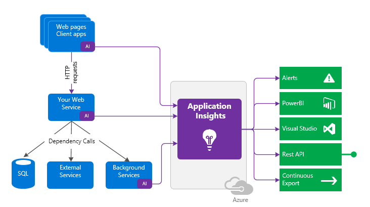
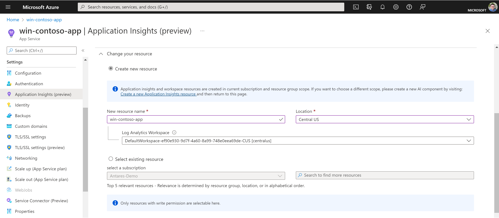
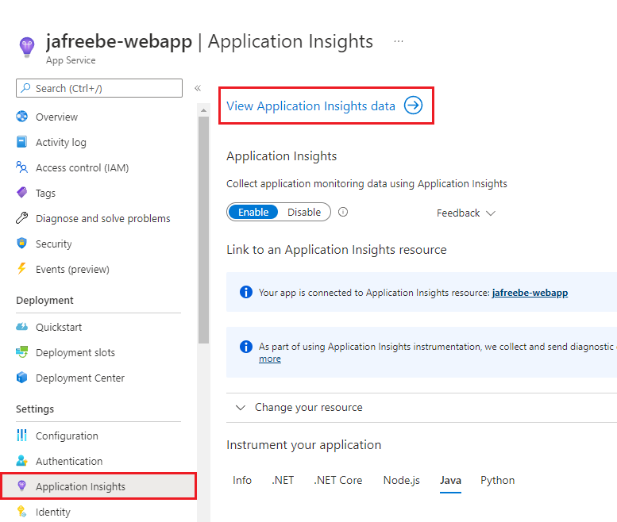
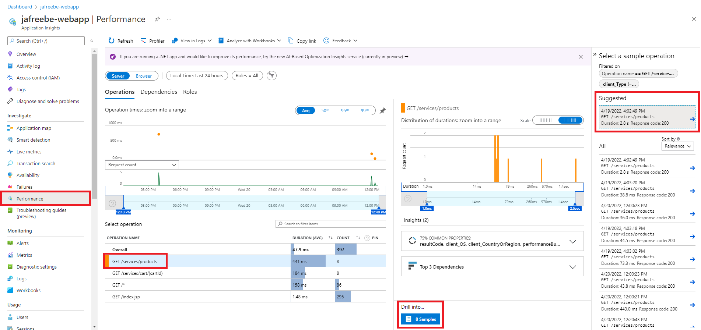
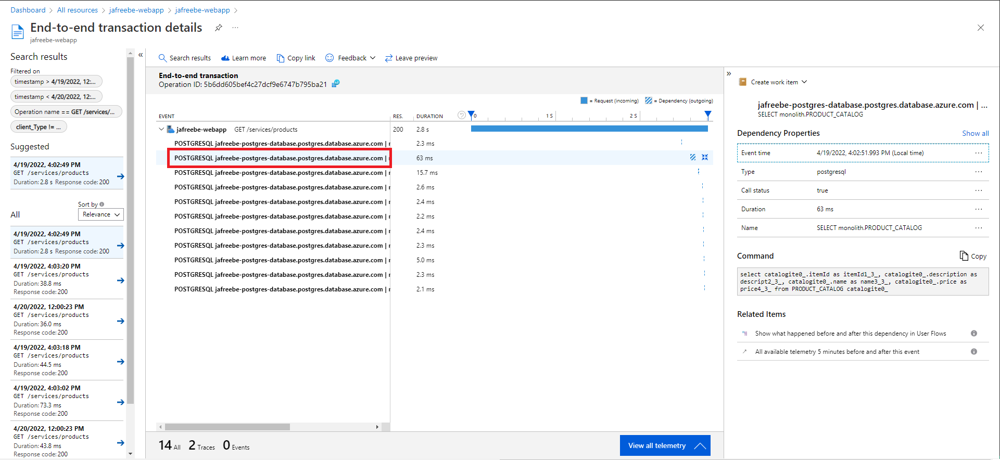

# A - Application Insights

> Note: Complete sections [1 through 5](../README.md#core-sections) before starting this section, as you will need a JBoss EAP Azure web app and Java EE application deployed for this section.

# A.1 - Learn about Application Insights

Application Insights is a feature of Azure Monitor that provides extensible application performance management (APM) and monitoring for live web apps. Developers and DevOps professionals can use Application Insights to:

- Automatically detect performance anomalies
- Help diagnose issues by using powerful analytics tools
- See what users actually do with apps
- Help continuously improve app performance and usability



To use Application Insights, you either install a small instrumentation package (SDK) in your app, or enable Application Insights via auto-instrumentation. [Auto-Instrumentation](https://docs.microsoft.com/azure/azure-monitor/app/codeless-overview) allows you to monitor your applications with App Insights **without changing your code or dependencies**. When enabled, the App Service platform will configure and attach the agent to the application in your container. Once attached, metrics such as requests, dependencies, latency, and stack traces will flow into your Application Insights resource where you can analyze the data and set up alerts.

## A.2 - Exercise: Enable Application Insights

Enabling Application Insights on App Service is easy since no code changes are required. Open the Azure Portal and go to your App Service resource.

1. In the left-side menu, go to **Application Insights** under **Settings**
1. Select **Turn on Application Insights**
1. Select a Location for your Application Insights resource to be created. (It's suggested to create the resource in the same region as the Web App.)

    

1. Click **Apply** to save your changes

That's it! When you save the settings your web app will restart, the App Insights agent will attach to the Java process, and the agent will begin sending information to the Application Insights resource. The next section will provide a tour of Application Insights.

## A.3 - Exercise: Explore Application Insights

Now that Application Insights is enabled, let's explore some of the features that are offered:

- [Performance](#a31---performance)
- [Live metrics](#a32---view-live-metrics)

First, open your Application Insights resource. If you're still viewing your App Service resource, go to **Applicatio Insights** and click **View Application Insights data** at the top of the blade.



### A.3.1 - Performance

Azure Application Insights collects telemetry from your application to help analyze its operation and performance. You can [use this information](https://docs.microsoft.com/azure/azure-monitor/app/tutorial-performance) to identify problems that may be occurring or to identify improvements to the application that would most impact users.

1. Select the Performance menu item
2. The Operations tab will show requests to the APIs of the CoolStore webapp, click `GET /services/products`
3. Click "Drill into Samples" at the bottom of the tab, and select the "Suggested" sample

    

4. This new blade will show the complete transaction details for that API request. Click on the line items, and the panel on the right will show the verbatim SQL commands.

    

    From this, we can see that most of the request duration is due to the transit time to the database since our connection is currently over the public internet. The connection will be much faster if we connected the database over a Virtual Network.

### A.3.2 - View Live Metrics

Monitor your live, in-production web application by using [Live Metrics Stream](https://docs.microsoft.com/azure/azure-monitor/app/live-stream) from Application Insights. In the left-side menu, click **Live Metrics**. Once the page loads, try running this CLI command to send some traffic to your web app:

```bash
for cnt in $(seq 100)
    do
        curl https://${WEBAPP_NAME}.azurewebsites.net/
    wait
done
```

Watch the metrics in the Portal and you should see them reflect the simulated traffic from your shell script.
