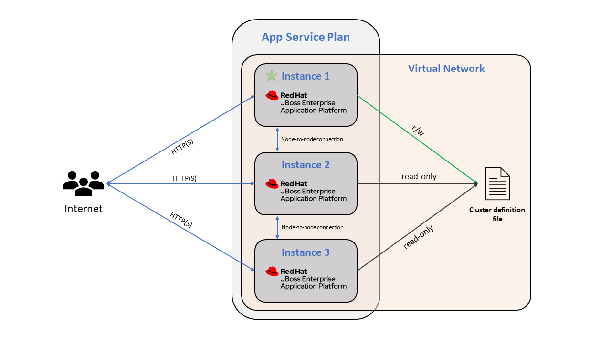

# B - Clustered Deployments

> Note: Complete [section 1](1-environment-setup.md) before starting this section.

## B.1 - About EAP Clustering

In JBoss EAP, clustering is a broad term which encompasses services such as load balancing between instances, failover, sharing session state, managing transactions, and more. There are two operating modes for EAP clusters: **managed domain** clusters and **standalone** clusters. The same capabilities are available in either operating mode, they are only different in how you manage the servers.

- [**Managed Domain**](https://access.redhat.com/documentation/en-us/red_hat_jboss_enterprise_application_platform/7.0/html/configuration_guide/domain_management): In this operating mode, a domain controller (and one or more host controllers) is the central control plane for the cluster.
- **Standalone**: In this operating mode, each member of the cluster has its own configuration.

## B.2 - EAP Clustering on App Service

On App Service, JBoss EAP is always deployed in **standalone mode** and Azure acts as the central management plane for deploying code, scaling in/out, updating configuration, etc. When you create a JBoss EAP site and join it to a virtual network, JBoss EAP will automatically be booted with a clustered configuration profile and use the virtual network for node-to-node communication. JBoss EAP on App Service uses the FILE_PING JGroups discovery protocol to discover instances. With FILE_PING, a common storage account persists the cluster information like the cluster members, their identifiers, and their IP addresses. This is the same discovery mechanism used for JBoss EAP on virtual machines, but on App Service the storage account is managed for you. Clustering can be disabled, see the documentation for [more information about clustering on App Service](https://docs.microsoft.com/azure/app-service/configure-language-java?pivots=platform-linux#jboss-eap).

## B.3 - Exercise: Deploy a stateful application to an EAP cluster

In this exercise, you will deploy an ARM template which contains an App Service Plan, virtual network, and JBoss EAP web app. The App Service Plan is scaled out to three instances, and the web app is joined to the virtual network. Once this template is deployed, the JBoss EAP web app will boot with a clustered configuration profile.

**Follow the instructions in this Azure Sample: [Deploy a stateful Java EE application to JBoss EAP on App Service](https://github.com/Azure-Samples/clustered-jboss-demo)**
