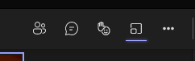

# Moderation Guide

> This document has notes and instructions for setting up and delivering this workshop. For questions or clarification, contact Jason Freeberg.

---

## Preparation

Your participants must have a valid Azure Subscription. If the participants are already using Azure, they can likely use their organization's development, test, or other appropriate subscription. If that is not an option for your participants, you can [request Azure Passes](#how-to-request-azure-passes) so they can receive credits in a new subscription.

One week before the workshop, send your participants an email ([example](example-email.md)) the following information:

- The Azure Pass website where participants can redeem their Pass and create a subscription (if applicable)
- Link to this workshop repository on GitHub.com
- Instructions to deploy the App Service Environment the day before the workshop

The participants will need to create the ASE the day before to the workshop by deploying an ARM template. It is important that the participants deploy the template before the workshop, as the ASE takes up to **3 hours** to deploy.

### How To Request Azure Passes

Azure Passes will provide the participants with a **new** Azure Subscription credited with a spend limit. If your participants need Azure Passes for the workshop, follow the steps below.

1. Contact Nate Ceres, let him know that you are delivering the JBoss EAP migration workshop and require Azure Passes for your participants. You will need to provide the following information:
    - The number of participants in your workshop
    - The date of the workshop
    - The value of the Azure Pass credits: **$75**
2. Once you receive the Azure Pass codes, send them [in an email](example-email.md) to the participants with instructions to redeem the code.

## Managing breakout rooms on Teams

If you're using Microsoft Teams to deliver the workshop, you can create breakout rooms. These are helpful if someone has a question and you want to answer it without "bothering" all the other participants who may be working. 

1. Click the breakout room button

   

2. On the pop-up:
   - Choose the number of rooms you want to make (probably **1**)
   - Click **Manually**, this will let you select the people you want to move
3. Select the participant(s) you want to bring into the room, then click **Assign**

**Important**: When you're ready to leave back to the main room, simply close the room. Do **not** have the participants click the "Leave" button, this will make them leave the main call as well!

## Common participant mistakes

Here are some common mistakes that participants may make during your session:

1. **Cannot make commits from GitPod to their fork of the repo.** If users follow the setup instructions described in , then they shouldn't run into this. If they somehow do, they can go to **Settings > Integrations > GitHub > Edit Permission** and enable "repo" permissions.
2. **User can't create the multi-tenant webapp due to naming conflict**. The participants will create an ASE before the workshop using the ARM template. The ASE webapp can't have the same name as the one created in section 2. So have the user use a different name fot the multi-tenant web app.

## Tips

1. Let participants know they can quickly copy the code/commands using the **copy** button in the code blocks:
    

## Modules

Delivering the full workshop (sections 1 to 8) will take half a day 3-5 hours depending if the group takes breaks and if they work independently or if the moderator does every section on-screen. Alternatively you can also take a subset of these sections to deliver a shorter workshop

### 30 minutes to 1 hour

The application can actually run on EAP with no code changes, so you can skip the WebLogic to EAP migration and just deploy the application.

1. [Environment setup](../instructions/1-environment-setup.md)
1. [Learn About App Service](../instructions/2-learn-about-app-service.md)
1. [Create PostgreSQL](../instructions/4-create-postgres-on-azure.md)
1. [Set up GitHub Actions](../instructions/5-set-up-github-actions.md)

### 2 to 3 hours

You can remove the App Service Environment Sections to save time and just use the multi-tenant version of App Service.

1. [Environment setup](../instructions/1-environment-setup.md)
1. [Learn About App Service](../instructions/2-learn-about-app-service.md)
1. [Migrate Weblogic to EAP](../instructions/3-migrate-weblogic-to-jboss.md)
1. [Create PostgreSQL](../instructions/4-create-postgres-on-azure.md)
1. [Set up GitHub Actions](../instructions/5-set-up-github-actions.md)
